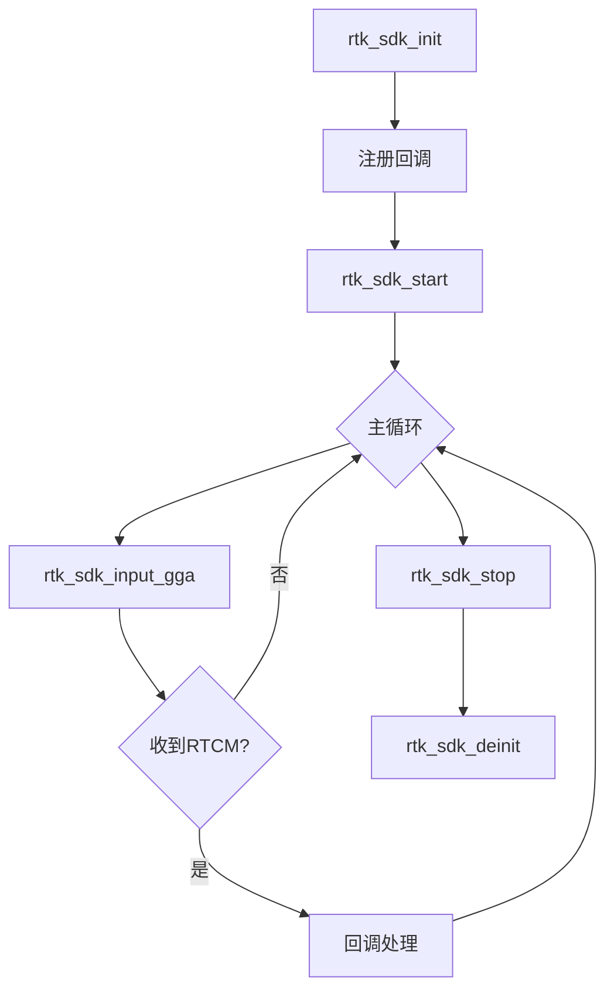
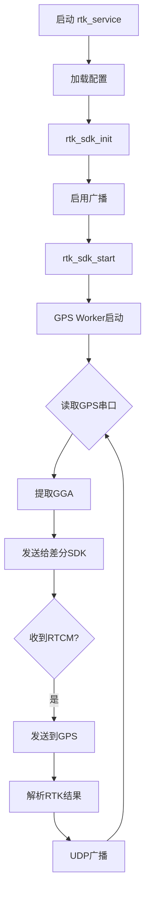

# RTK SDK API 文档

> 版本: 1.0.0  
> 更新日期: 2026-02-04

---

## 目录

1. [概述](#1-概述)
2. [快速开始](#2-快速开始)
3. [API参考](#3-api参考)
4. [数据结构](#4-数据结构)
5. [错误码](#5-错误码)
6. [使用流程](#6-使用流程)
7. [注意事项](#7-注意事项)
8. [示例代码](#8-示例代码)

---

## 1. 概述

RTK SDK 是基于六分科技差分SDK封装的高精度定位库，提供厘米级RTK定位能力。

### 1.1 功能特性

| 功能 | 说明 |
|------|------|
| RTCM差分获取 | 通过云端获取RTCM3差分数据 |
| 双模式支持 | 线程库模式 + 独立进程模式 |
| GPS串口管理 | 自动读取GPS数据、发送差分 |
| UDP广播 | 进程模式下广播RTK定位结果 |
| 日志系统 | 多级别日志，支持开关控制 |

### 1.2 目录结构

```
rtk_sdk/
├── include/
│   └── rtk_sdk.h           # 公开API头文件
├── src/                    # 源码目录
├── thirdparty/sixents/     # 六分科技SDK
├── main/rtk_main.c         # 进程入口
├── Makefile                # x86构建
├── Makefile.arm            # ARM交叉编译
└── rtk_sdk.conf.example    # 配置示例
```

---

## 2. 快速开始

### 2.1 编译

```bash
# ARM交叉编译
make -f Makefile.arm

# 输出文件
# lib-arm/librtk_sdk.so    动态库
# lib-arm/librtk_sdk.a     静态库
# build-arm/rtk_service    独立进程
```

### 2.2 配置文件

```ini
[auth]
ak = your_access_key
as = your_access_secret
device_id = DEVICE_001
device_type = rtk_receiver

[broadcast]
port = 9000
address = 255.255.255.255

[gps_serial]
port = /dev/ttyUSB0
baudrate = 115200
auto_mode = 1

[log]
level = 3
file = /var/log/rtk.log
```

### 2.3 运行

```bash
./rtk_service -c rtk_sdk.conf
```

---

## 3. API参考

### 3.1 核心API

#### `rtk_sdk_init`
```c
int rtk_sdk_init(const rtk_config_t *config);
```
| 参数 | 说明 |
|------|------|
| config | 配置结构体指针，不能为空 |
| 返回值 | RTK_OK(0)成功，负值失败 |

> ⚠️ 必须在其他API之前调用

---

#### `rtk_sdk_deinit`
```c
void rtk_sdk_deinit(void);
```
释放所有资源，程序退出前必须调用。

---

#### `rtk_sdk_start`
```c
int rtk_sdk_start(void);
```
启动RTK定位服务，创建工作线程并连接服务器。

---

#### `rtk_sdk_stop`
```c
void rtk_sdk_stop(void);
```
停止RTK定位服务，断开连接。

---

#### `rtk_sdk_get_state`
```c
rtk_state_t rtk_sdk_get_state(void);
```
获取当前SDK运行状态。

| 状态值 | 含义 |
|--------|------|
| RTK_STATE_IDLE | 未初始化 |
| RTK_STATE_INIT | 已初始化 |
| RTK_STATE_CONNECTING | 连接中 |
| RTK_STATE_RUNNING | 运行中 |
| RTK_STATE_STOPPING | 停止中 |
| RTK_STATE_ERROR | 错误状态 |

---

### 3.2 GGA数据输入

#### `rtk_sdk_input_gga`
```c
int rtk_sdk_input_gga(const char *gga_str, int len);
```
输入NMEA格式的GGA语句。

| 参数 | 说明 |
|------|------|
| gga_str | GGA字符串，如 `$GPGGA,123519,4807.038,N,...` |
| len | 字符串长度 |

> 📌 建议每1秒调用一次

---

#### `rtk_sdk_input_position`
```c
int rtk_sdk_input_position(double lat, double lon, double alt);
```
输入经纬度高度，SDK内部构造GGA。

---

### 3.3 回调注册

#### `rtk_sdk_set_rtcm_callback`
```c
void rtk_sdk_set_rtcm_callback(rtk_rtcm_callback_t cb, void *user_data);
```
注册RTCM差分数据回调。

**回调原型：**
```c
typedef void (*rtk_rtcm_callback_t)(
    const uint8_t *data,    // RTCM二进制数据
    int len,                // 数据长度
    void *user_data         // 用户数据
);
```

> ⚠️ 回调在工作线程执行，请勿阻塞

---

#### `rtk_sdk_set_status_callback`
```c
void rtk_sdk_set_status_callback(rtk_status_callback_t cb, void *user_data);
```
注册状态变化回调。

---

#### `rtk_sdk_set_error_callback`
```c
void rtk_sdk_set_error_callback(rtk_error_callback_t cb, void *user_data);
```
注册错误回调。

---

### 3.4 UDP广播控制

#### `rtk_sdk_enable_broadcast`
```c
int rtk_sdk_enable_broadcast(int port, const char *broadcast_addr);
```
启用UDP广播（进程模式）。

| 参数 | 说明 |
|------|------|
| port | 广播端口，如9000 |
| broadcast_addr | 广播地址，NULL使用默认255.255.255.255 |

---

#### `rtk_sdk_disable_broadcast`
```c
void rtk_sdk_disable_broadcast(void);
```
禁用UDP广播。

---

### 3.5 GPS串口控制

#### `rtk_sdk_open_gps_serial`
```c
int rtk_sdk_open_gps_serial(const char *port, int baudrate);
```
打开GPS串口。

| 参数 | 说明 |
|------|------|
| port | 设备路径，如 `/dev/ttyUSB0` |
| baudrate | 波特率，默认115200 |

---

#### `rtk_sdk_close_gps_serial`
```c
void rtk_sdk_close_gps_serial(void);
```
关闭GPS串口。

---

### 3.6 日志控制

#### `rtk_sdk_set_log_level`
```c
void rtk_sdk_set_log_level(rtk_log_level_t level);
```
设置日志级别。

| 级别 | 值 | 说明 |
|------|----|------|
| RTK_LOG_OFF | 0 | 关闭 |
| RTK_LOG_ERROR | 1 | 错误 |
| RTK_LOG_WARN | 2 | 警告 |
| RTK_LOG_INFO | 3 | 信息 |
| RTK_LOG_DEBUG | 4 | 调试 |

---

#### `rtk_log_set_enabled`
```c
void rtk_log_set_enabled(int enabled);
```
全局日志开关。

| 参数 | 说明 |
|------|------|
| 1 | 启用日志 |
| 0 | 禁用所有日志 |

---

#### `rtk_log_set_console_enabled`
```c
void rtk_log_set_console_enabled(int enabled);
```
控制台输出开关。

---

#### `rtk_log_set_file_enabled`
```c
void rtk_log_set_file_enabled(int enabled);
```
文件输出开关。

---

## 4. 数据结构

### 4.1 配置结构体

```c
typedef struct {
    /* 鉴权信息（必填） */
    char ak[64];                    // Access Key
    char as[128];                   // Access Secret
    char device_id[64];             // 设备ID
    char device_type[64];           // 设备类型
    
    /* 网络配置 */
    int timeout_sec;                // 超时时间(秒)，默认10
    int use_https;                  // 是否HTTPS，默认0
    
    /* 广播配置 */
    int broadcast_port;             // UDP端口，默认9000
    char broadcast_addr[64];        // 广播地址
    
    /* GPS串口配置 */
    char gps_serial_port[64];       // 串口设备
    int gps_serial_baudrate;        // 波特率
    int gps_auto_mode;              // 自动模式
    
    /* 日志配置 */
    rtk_log_level_t log_level;      // 日志级别
    char log_file[256];             // 日志文件
} rtk_config_t;
```

### 4.2 定位结果结构体

```c
typedef struct {
    double latitude;            // 纬度（度）
    double longitude;           // 经度（度）
    double altitude;            // 海拔高度（米）
    double hdop;                // 水平精度因子
    int fix_quality;            // 定位质量 0:无效 1:单点 2:差分 4:RTK固定 5:RTK浮动
    int satellites;             // 可见卫星数
    uint64_t timestamp_ms;      // 时间戳（毫秒）
} rtk_position_result_t;
```

---

## 5. 错误码

| 错误码 | 值 | 说明 |
|--------|-----|------|
| RTK_OK | 0 | 成功 |
| RTK_ERR_INVALID_PARAM | -1 | 无效参数 |
| RTK_ERR_NULL_PTR | -2 | 空指针 |
| RTK_ERR_NOT_INIT | -100 | 未初始化 |
| RTK_ERR_ALREADY_INIT | -101 | 重复初始化 |
| RTK_ERR_NOT_RUNNING | -102 | 未运行 |
| RTK_ERR_AUTH_FAILED | -200 | 鉴权失败 |
| RTK_ERR_CONNECT_FAILED | -201 | 连接失败 |
| RTK_ERR_TIMEOUT | -202 | 超时 |
| RTK_ERR_THREAD | -300 | 线程创建失败 |
| RTK_ERR_FILE | -303 | 文件操作失败 |
| RTK_ERR_SIXENTS_INIT | -400 | 六分SDK初始化失败 |

---

## 6. 使用流程

### 6.1 线程库模式流程



### 6.2 进程模式流程（GPS自动模式）



### 6.3 API调用顺序

```c
// 1. 初始化
rtk_sdk_init(&config);

// 2. 注册回调（线程库模式）
rtk_sdk_set_rtcm_callback(on_rtcm, NULL);
rtk_sdk_set_status_callback(on_status, NULL);
rtk_sdk_set_error_callback(on_error, NULL);

// 3. 启用广播（进程模式）
rtk_sdk_enable_broadcast(9000, NULL);

// 4. 启动服务
rtk_sdk_start();

// 5. 输入GGA数据（线程库模式）
while (running) {
    rtk_sdk_input_gga(gga, strlen(gga));
    sleep(1);
}

// 6. 停止和清理
rtk_sdk_stop();
rtk_sdk_deinit();
```

---

## 7. 注意事项

### 7.1 线程安全

- ✅ 所有公开API都是线程安全的
- ✅ 回调在工作线程中执行
- ⚠️ 回调函数内请勿执行耗时操作
- ⚠️ 回调函数内请勿调用SDK的stop/deinit

### 7.2 GGA数据要求

- 必须符合NMEA-0183格式
- 支持 `$GPGGA` 和 `$GNGGA`
- 建议每1秒发送一次
- 位置需在服务覆盖范围内

### 7.3 资源管理

- `rtk_sdk_init` 和 `rtk_sdk_deinit` 必须配对
- 程序退出前必须调用 `rtk_sdk_deinit`
- 重复初始化会返回错误

### 7.4 串口重连

- 串口异常断开会自动重连
- 最大重连次数：5次
- 连续3次读取错误触发重连
- 重连间隔：2秒

### 7.5 日志管理

```c
// 生产环境建议禁用控制台日志
rtk_log_set_console_enabled(0);  // 禁用控制台
rtk_log_set_file_enabled(1);     // 启用文件

// 高性能场景可完全禁用
rtk_log_set_enabled(0);
```

### 7.6 配置文件注意

- AK/AS请勿硬编码在代码中
- 配置文件权限建议设为600
- 敏感信息不会出现在命令行参数

---

## 8. 示例代码

### 8.1 线程库模式

```c
#include "rtk_sdk.h"
#include <stdio.h>
#include <string.h>
#include <unistd.h>

// RTCM回调 - 收到差分数据发送给GPS
void on_rtcm(const uint8_t *data, int len, void *user) {
    printf("收到RTCM: %d 字节\n", len);
    // send_to_gps(data, len);
}

// 状态回调
void on_status(rtk_state_t state, int code, void *user) {
    const char *names[] = {"IDLE", "INIT", "CONNECTING", "RUNNING", "STOPPING", "ERROR"};
    printf("状态变化: %s, 代码: %d\n", names[state], code);
}

int main() {
    // 配置
    rtk_config_t cfg = {0};
    strcpy(cfg.ak, "your_ak");
    strcpy(cfg.as, "your_as");
    strcpy(cfg.device_id, "DEV001");
    strcpy(cfg.device_type, "test");
    cfg.log_level = RTK_LOG_INFO;
    
    // 初始化
    if (rtk_sdk_init(&cfg) != RTK_OK) {
        printf("初始化失败\n");
        return -1;
    }
    
    // 注册回调
    rtk_sdk_set_rtcm_callback(on_rtcm, NULL);
    rtk_sdk_set_status_callback(on_status, NULL);
    
    // 启动
    if (rtk_sdk_start() != RTK_OK) {
        printf("启动失败\n");
        rtk_sdk_deinit();
        return -1;
    }
    
    // 主循环
    const char *gga = "$GPGGA,123519,3929.95,N,11614.85,E,1,08,0.9,545.4,M,47.0,M,,*72\r\n";
    for (int i = 0; i < 60; i++) {
        rtk_sdk_input_gga(gga, strlen(gga));
        sleep(1);
    }
    
    // 清理
    rtk_sdk_stop();
    rtk_sdk_deinit();
    
    return 0;
}
```

### 8.2 UDP接收端

```c
#include <stdio.h>
#include <string.h>
#include <sys/socket.h>
#include <netinet/in.h>

int main() {
    int sock = socket(AF_INET, SOCK_DGRAM, 0);
    
    struct sockaddr_in addr = {
        .sin_family = AF_INET,
        .sin_port = htons(9000),
        .sin_addr.s_addr = INADDR_ANY
    };
    
    bind(sock, (struct sockaddr*)&addr, sizeof(addr));
    
    char buf[2048];
    while (1) {
        int len = recvfrom(sock, buf, sizeof(buf) - 1, 0, NULL, NULL);
        if (len > 0) {
            buf[len] = '\0';
            // 检查是否为JSON定位结果
            if (buf[0] == '{') {
                printf("RTK定位: %s\n", buf);
            } else {
                printf("RTCM: %d 字节\n", len);
            }
        }
    }
    
    return 0;
}
```

---

## 附录：广播数据格式

### RTCM差分数据
原始RTCM3二进制数据，直接发送给GPS模块。

### RTK定位结果（JSON）
```json
{
    "type": "rtk_position",
    "lat": 39.12345678,
    "lon": 116.12345678,
    "alt": 45.123,
    "hdop": 0.8,
    "fix": 4,
    "sat": 12,
    "ts": 1234567890123
}
```

| 字段 | 说明 |
|------|------|
| fix | 定位质量：0无效 1单点 2差分 **4RTK固定** 5RTK浮动 |
| sat | 可见卫星数 |
| ts | 毫秒时间戳 |
